# Exercise 04 To Do App v2

### Carl Joven M. Marasigan

### 2019-03365

### WX-4L

# Exercise Description

> A flutter application (To do app v2) that sends and receives data from the network..

# Naming your App

```
surnameinitials_exer3_section e.g. (arriolajmt_exer3_wx1l).
```

# Documentation

- You must add screenshots of your work.\
  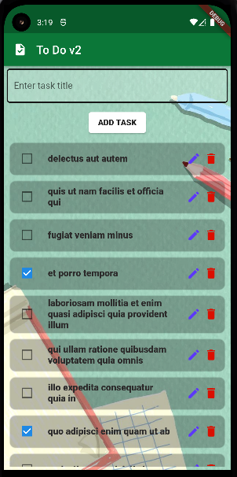 

- What did you add to the code.
  > My exercise 3 code serves as my template for this exercise. I modified the template based on the exercise's requirements, which is also a To Do App but communicates with a network. I added the network functionalities. These are the fetching (get), adding (post), updating (put), and deleting (delete) of data from the network.
- How are you able to do the exercise.
  > Exercise 3's code and the links provided helped me a lot. I modified the exercise 3 to fit the requirements and use the code in the links provided to implement functions needed to communicate to the network. I also searched the Internet for unfamilliar syntax.
- Challenges met while doing the exercise.
  > At first, I had difficulties sending and receiving data from the network. The one I find the most difficult is the first network request I implemented, the get request. I could not properly fetch the todo tasks. There were data types mismatch/errors when I tried to receive data from the network and display them in the screen. I eventually got it through analyzing, trial and errors, and looking for the documentations.
- Happy paths and Unhappy paths encountered.

### - Happy paths encountered

### Fetching the tasks

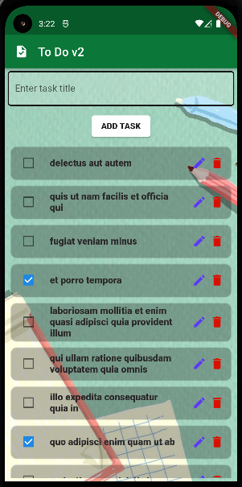 

#### To reproduce:

- Just open the app.

#### Result

- App works and does not produce any errors. All tasks from the network is displayed.

### Adding a task

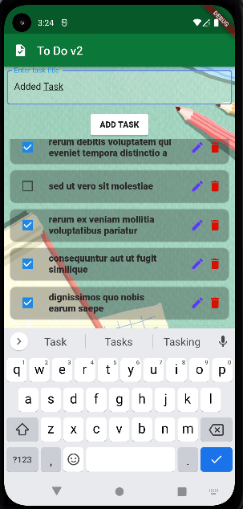 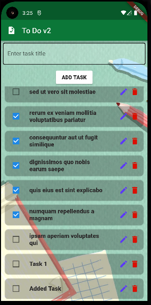

#### To reproduce:

- Enter task title then click add task.

#### Result

- App works and does not produce any errors. Task is added, input is cleared, and the task created is displayed in the task list.

### Checking/Unchecking a task

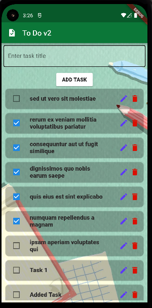 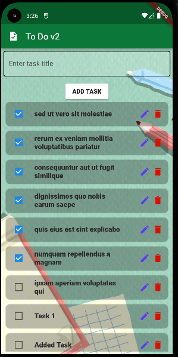

#### To reproduce:

- Tap/click the checkbox of a task repeatedly.

#### Result

- App works and does not produce any errors. Checkbox check and uncheck alternates.

### Editing a task

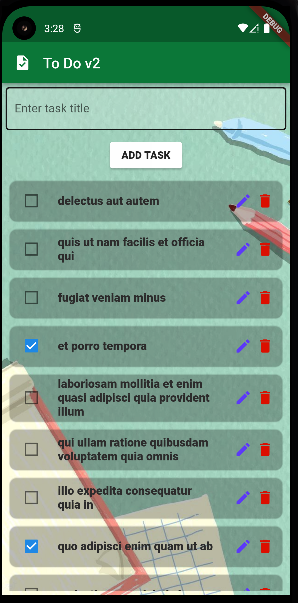 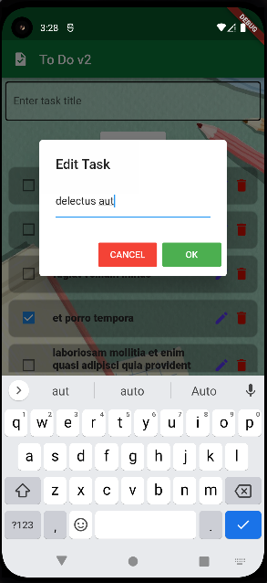


#### To reproduce:

- Tap/click the edit (pencil-like) button.

#### Result

- App works and does not produce any errors. A modal/dialog shows where user can input the edits he/she want to make. Clicking the okay button will save the edit.

### Cancelling an edit

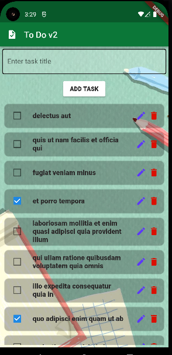 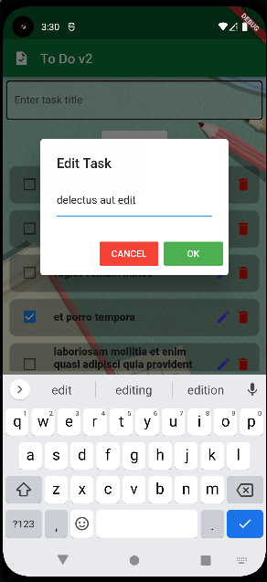
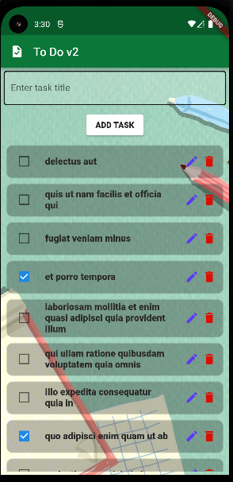

#### To reproduce:

- Tap/click the edit (pencil-like) button, change the task title, then cancel.

#### Result

- App works and does not produce any errors. The change does not reflect in the list and a request in the network does not occur.

### Delete a task

 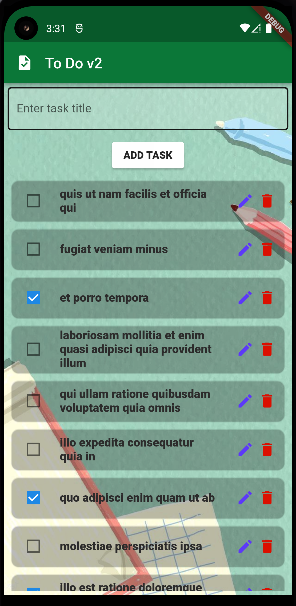

#### To reproduce:

- Tap/click the delete icon of a task in the Task List.

#### Result

- App works and does not produce any errors. The task is removed in the GUI without reloading and the delete request is successful. A snackbar prompting "Successfully Deleted" also appears.

### - Unhappy paths encountered

### Fetching the tasks

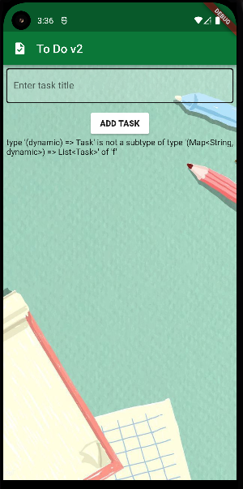

#### To reproduce:

- Just open the app.

#### Result

- Task fetched unsuccessfuly. An error is displayed in the screen.

:smile_cat: contact your lab instructor if you have any concerns, inquiries or problems in your exercise.
