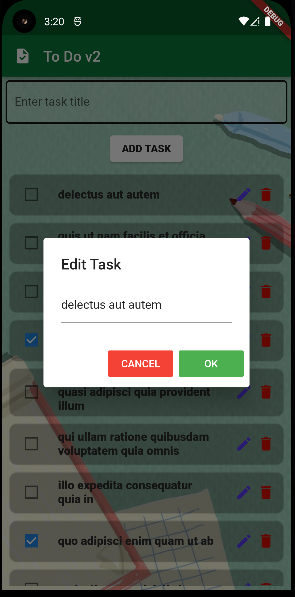

# Exercise 04 To Do App v2

# Exercise Description

> A flutter application (To do app v2) that sends and receives data from the network..

# Documentation

- You must add screenshots of your work.\
   
